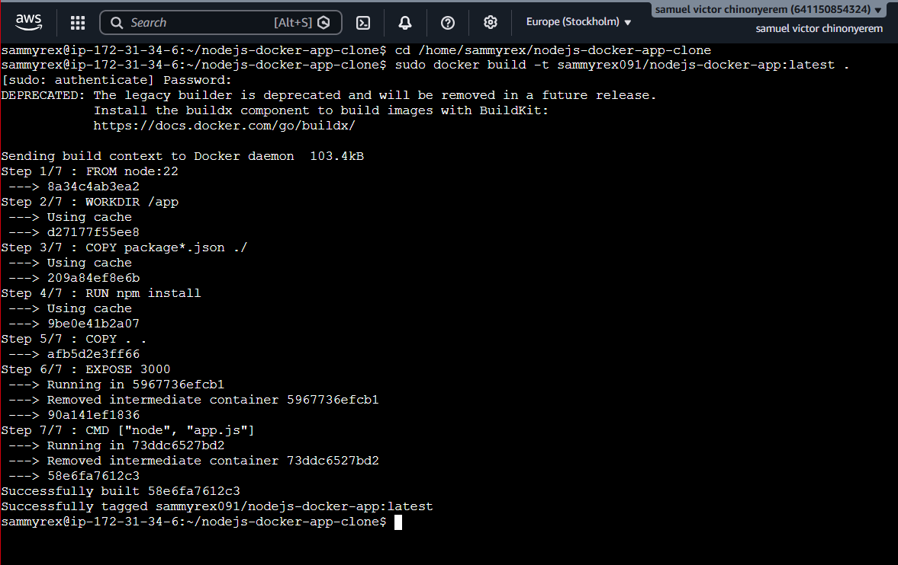
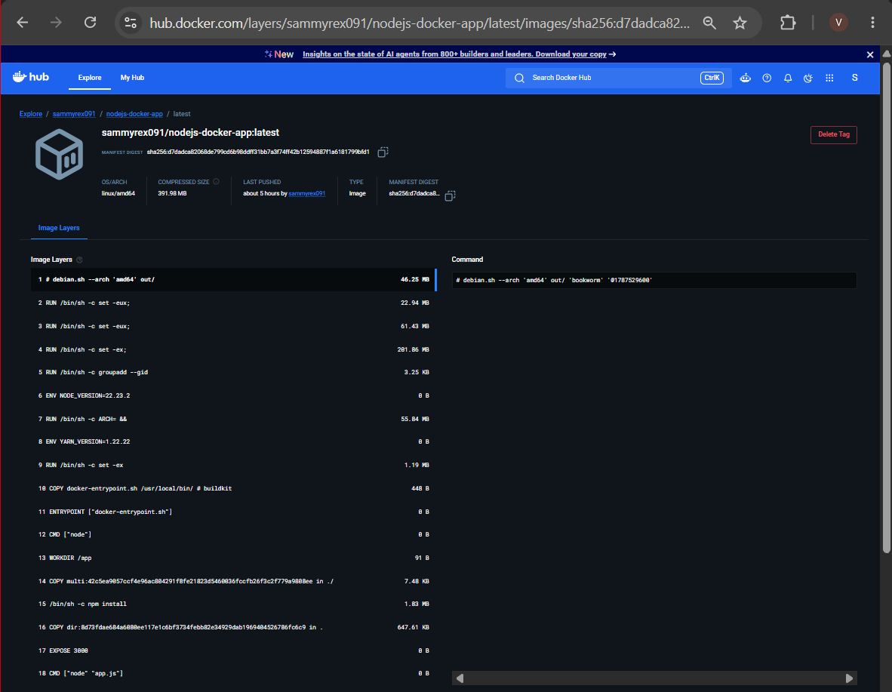
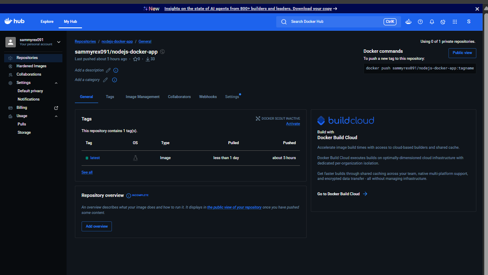
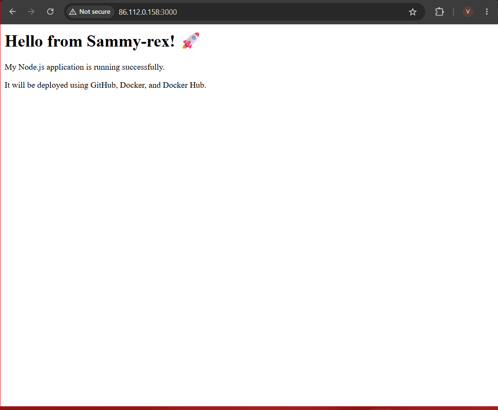

# Node.js & Docker Deployment AssignmentXc

## Project Overview

This project demonstrates the deployment of a Node.js application using GitHub, Linux, Docker, Docker Hub, and AWS EC2.

The application is a simple Express.js web application running on port 3000.

## Technologies Used

- Node.js
- Express.js
- Ubuntu Linux
- Git and GitHub
- Docker
- Docker Hub
- AWS EC2

## 1. Node.js Application

The application was created using Node.js and Express.js.

The application displays:

**Hello from Sammy-rex! 🚀**

The application runs on port 3000.

## 2. GitHub Repository

The application source code was pushed to GitHub.

GitHub Repository:

https://github.com/sammy-rex/nodejs-docker-app

The repository contains:

- app.js
- package.json
- package-lock.json
- Dockerfile
- README.md

## 3. Clone Application to Linux Server

The GitHub repository was successfully cloned to the Ubuntu Linux server.

The cloned application was verified and contains the required application files:

- Dockerfile
- app.js
- package-lock.json
- package.json

## 4. Dockerfile

The following Dockerfile was used to containerize the Node.js application:

```dockerfile
FROM node:22

WORKDIR /app

COPY package*.json ./

RUN npm install

COPY . .

EXPOSE 3000

CMD ["node", "app.js"]
## 5. Docker Image Build

The Docker image was successfully built using the following command:

    sudo docker build -t sammyrex091/nodejs-docker-app:latest .

### Docker Image Build Screenshot



## 6. Docker Hub Image

The Docker image was successfully pushed to Docker Hub.

Docker Hub image:

**sammyrex091/nodejs-docker-app:latest**

### Docker Hub Screenshot



## 7. Pull Image from Docker Hub

The Docker image was successfully pulled from Docker Hub using:

    sudo docker pull sammyrex091/nodejs-docker-app:latest

### Docker Hub Pull Screenshot



## 8. Running Docker Container

The Docker container was successfully created from the Docker Hub image using:

    sudo docker run -d -p 3000:3000 --name sammyrex-node-container sammyrex091/nodejs-docker-app:latest

The running container was verified using:

    sudo docker ps

### Running Docker Container Screenshot


## 9. Live Application

The Node.js application was successfully deployed on the AWS EC2 server and accessed through the EC2 public IP address on port 3000.

Application URL:

http://86.112.0.158:3000

### Live Application Screenshot



## Conclusion

The Node.js application was successfully developed, pushed to GitHub, cloned to an Ubuntu Linux server, containerized using Docker, pushed to Docker Hub, pulled from Docker Hub, and deployed as a running Docker container on AWS EC2.

All major deployment requirements were completed successfully.
